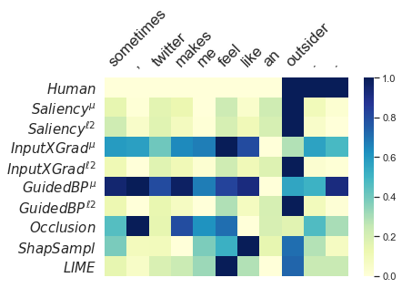

# A Diagnostic Study of Explainability Techniques for Text Classification

This is repository for the paper 
[A Diagnostic Study of Explainability Techniques for Text Classification]() 
accepted at EMNLP 2020.

  

In this paper, we develop a comprehensive list of diagnostic properties
for evaluating existing explainability techniques. We then employ the proposed 
list to compare a set of diverse explainability techniques on downstream text 
classification tasks and neural network architectures. We also compare the 
saliency scores assigned by the explainability techniques with human 
annotations of salient input regions to find relations between a model's 
performance and the agreement of its rationales with human ones. Overall, we 
find that the gradient-based explanations perform best across tasks and model 
architectures, and we present further insights into the properties of the 
reviewed explainability techniques.

## Code Base

### preprocessing
The SNLI dataset is used as is. For the IMDB and the TSE datasets, 
we have to make additional splits with the scripts in the package. 
